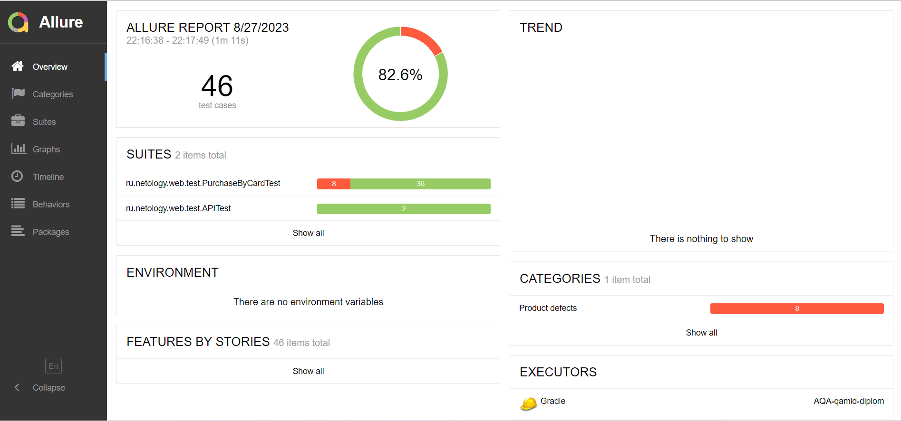
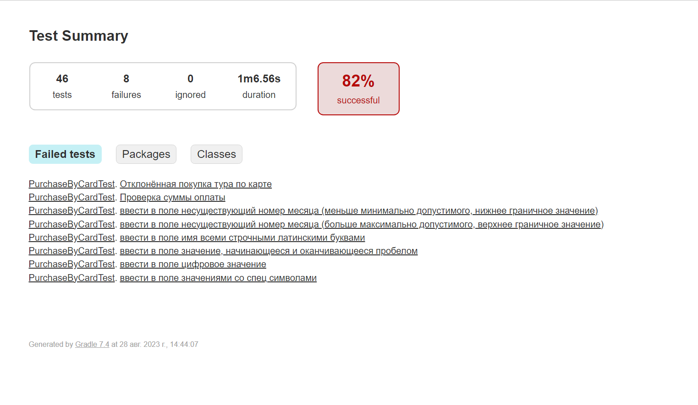

# Отчёт по итогам тестирования

## Описание
Задачей проекта являлось функциональное тестирование комплексного сервиса для покупки туристического тура, взаимодействующего с БД и API банка.

На первом этапе работы было проведено исследовательское тестирование для ознакомления с сервисом. После первоначального ознакомления был разработан [План автоматизации тестирования](Plan.md), в котором были реализованы: 
* перечень автоматизируемых сценариев;
* перечень используемых инструментов с обоснованием выбора;
* перечень и описание возможных рисков при автоматизации;
* интервальная оценка с учётом рисков в часах;
* план сдачи работ: когда будут проведены автотесты, результаты их проведения и отчёт по автоматизации.

Второй этап включал в себя подготовку тестового окружения, написания вспомогательных классов, методов, а также написание тестов, проверяющих позитивные и негативные сценарии.

Тестирование проводилось на одной БД — MySQL.

## Выполнение тестирования

В ходе автоматизации было разработано 46 тестовых сценария. Из них: 44 — UI-тесты, 2 — API-тесты.

* Успешно завершённых тестов — 38 (82%);
* Упавших тестов — 8 (18%).

### Отчёт о проведённом тестировании Allure

### Список не успешных тестов

### Отчёт Gradle

## Общие рекомендации

Для повышения качества разрабатываемого сервиса необходима разработка и ведение документации. Это позволит сократить как временные, так и финансовые затраты, связанные возможным появлением дефектов, их выявлением и устранением.

Также необходимо устранить выявленные в процессе тестирования [дефекты](https://github.com/Alexey-A-Zaitsev/Aqa_qamid_course_project/issues).

В целях предотвращения появления новых дефектов, а также упрощения, и, как следствие, сокращение времени затрачиваемого на тестирование, рекомендуется:
* добавление в разметку страниц тестовых меток (data-test-id) для основных элементов;
* задокументировать и реализовать системно требования к валидации полей;
* реализовать более логичные и понятные пользователю подсказки, отображаемые под полями формы при вводе некорректной информации.

